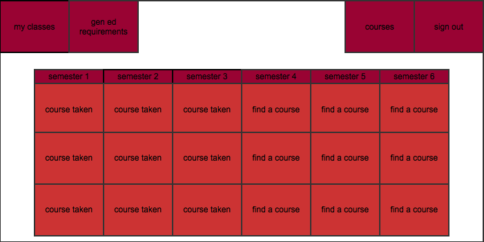

# inSPIRE 
 
###### 'A Trail For Success'

## Meet the Team

+Yong's role in the team will be facilitate the progress of the releases cycles. He also will be looking into the database design and intergration with the server host.

+Sam will be conducting the user research from both the student perspective and the administrator perspective. This process involves iterations of UX Design, prototyping, and user testing. The goal here is to solidify our idea and make sure our features are validated. In addition to that he will be part of the team that designs and implements the cloud code in the way it processes and transfers data from the server to the client. 

+Alex is going to be doing the server side programming. He will optimize the server such that it runs quickly and efficiently. There will be no bugs and no way to hack in once he is finished.

+Andrew will be most concerned with front-end work and the interface. The goal is to have a very easy to use and visually satisfying program that cooperates well with the back-end and database. 

+Khanh's role will be to come up with our data modelling algorithm and database structure. He will be in charge of the way our data looks when being queried.
I will help with designing programs, factoring and testing code. I will also help with debugging errors. My main focus is to make the app run more efficiently in term of both memory and time. Another goal is to revise code style to strengthen the maintainability aspect of the app.   

+Josh's role will be maintaining the back-end designs, intergrration of the server/client, and database setup.

## Overview

###### Core product
+	Our main product is a class timeline application, where student can select and display the classes they would need to complete their degree.
+	With this front end production, we can also introduce a product for the school/department admins to modify the class pre-reqs relationships.The admins would easily get an estimate summary of total student plans, which can help them plan ahead in assigning professors and classrooms. 

###### Social media 
+	To built on the student timeline application, we like to add in the social media aspect, where students can publish their class histories and plans on other websites, or as a link on their resume.
+	Another aspect of social media we like to implement is student experiences, comments on the path of classes they took. This will be available to other and be rated/ranked. This will be useful for new students to read, it will be like getting advising from a former student's perspective, which is difficult to do for most new students. 

###### Services
+	3rd party companies and employeer can submit request(fee) for student verification to the school admins on our site. This will be noted in the terms of service, that anyone will have the option to verify accuracy of the student profile.
+	Alternatively, students can choose self-verify(fee). This will archive their profile on our website like a "transcript". It will be useful for any type of job, internship, research, even college applications.

##Scenarios 
===============

1. Joe is a computer science major at UMass Amherst and he has been so busy that he forgot to register for courses and he needs to do it quickly before more people can register and he won't be able to get a spot! He doesn't need to worry though because thanks to the new inSPIRE he can quickly compare the list of courses on the website. From his basket of todo classes, he can see details such as eligiblity, and highlighted ones he must to take inorder to complete his degree/track. Being able to see all of these on one convenient page will save Joe time and help him get in class before those pesky freshman get a chance to register.

2. It’s August and the new semester is right around the corner. The computer science department has decided to add a few new course offerings this year, and also update a couple prerequisites and requirement fulfillments that pertain to a couple existing classes. Bob is a UMass administrator in charge of updating this data on on the inSPIRE database. With ease he logs into the website, enters his authentication information, and pulls up a spreadsheet-like window displaying course information in a table. He locates CMPSCI326, scrolls over to the “prerequisites” column, and adds CMPSCI220 as a listed prerequisite. He then finds CMPSCI250, and adds that it now fulfills the G requirement, because it is clearly a class that promotes awareness of global diversity. Finally, to add a new course he clicks on the plus icon and fills out all of the relevant information for the new course CMPSCI999. By clicking "done", this item is painlessly added to the database. His job is done in 5 minutes, and he can go home and take it easy. 

3. Jane is attempting to planning for courses she needs to take next semester in order to graduate on time, but she is getting so frustrated while using spire! She wants to find out what courses she needs to take but there is no way to tell which ones she has the pre-requisites for without tediously searching through each individual courses and then constantly hitting the back button. Fortunately thanks to inSPIRE she can see which courses she qualifies to take next and selects her classes from the recommanded list.

4. Cory and Derek are both general Computer Science majors. They are chatting about the requirements they need to fulfill the major. Derek tells Cory that they need to take 9 credits at the 400 level, or higher. Cory doesn't know any classes above the 400 level. He logs on to inSPIRE and goes to his requirements where it lists all the options for the 400+ level courses. He clicks on each of the classes, and a description comes up. The description tells him who teaches the class and provides a summary of the class. This helps Cory pick out 3 courses, and he's ready to cross these requirements off his list.

5. Bob is just a general computer science major going into his junior year, but he isn't sure what concentration he wants to go into. With inSPIRE he can look at the courses required for each subplan and then choose which one he thinks looks most interesting and start to plan his future semesters around that.

6.  Tim is entering the second semester of his Junior year, and is beginning to think about changing his sub-plan from General Computer Science to either Software Engineering or Security and Privacy, and enjoys both equally.  Tim has taken Algorithms, Operating Systems, Sofware Engineering, and Web Programming.  Using inSPIRE's easy to read interface, he sees that all of these classes are involved in the Software Engineering track, while three are involved with Security and Privacy.  Looking deeper into his course track, Tim notices that Software Enigineering Synthesis, and Analysis & Evaluation are offered, and fit into his schedule with the classes from his minor, while Security classes conflict with his necessary minor courses.  Tim decides that the Software Engineering track is the best for him.

7. Melinda is a campus recruiter at Google. She comes across an application for a summer internship in her database and is mildly interested in hiring this student George, but she would like to know more about his academic background. Since inSPIRE is so awesome and has been universally adopted as the standard student administration system, she goes on the public UMass inSPIRE page. She is able to look up that student profile and see his course history. Reading the details of the course descriptions, Melinda has a good idea about the core skills that he had completed. George also filled out his optional bio section and attached links to his impressive personal webpage. Melinda said to herself, "He’s halfway hired!".

8. Jean is entering her last semester at school and she still needs 2 computer science electives that she needs to take, but she has no idea what courses would be more interesting to learn. She saw a CS500 class avilable to signup. While looking through the reviews and thoughts from other students who had previously taken the course, she decides this class won't help her careerpath. She continues searching for classes and reading students reviews, and finally found her ideal 2 elective classes.

Non-Goals
=========

**High levels of Security** - This application is meant as an easy-to-use reference for courses, and a username and password are used only to help users easily access their data.  Therefore, no large security implementation will be used.

**Implementing every major** - Implementing every major would take a lot of time and would just be repeating the basic implementation we are demonstrating.

**Making ratemyprofessor.com 2.0** - We will have a course rating and review implemented but we will not be making a professor rating system since it has already been done, professors change for courses, and we don't want to end up in any hot water.

Open Issues
===========

- Web hosting companies are concerned that it will generate too much traffic and they won't be able to handle it
- Data mining of gen ed courses could be a real pain
- Making the UI look pretty 

Preliminary User Interface
==========================
 

The login page is that page that the admin and user will see when they go to log on. They will input their username and password and be redirected back if they fail to login. Otherwise they will be redirected to the mainpage.

 

The main page is the page that the user will see once they log on. They will be able to go to their classes, see their gen ed requirements, view a course database, and log out. It will also display the courses they have previously taken, which ones they are taken, and have a quick and easy way to look for new courses.
